# Kubernetes using AWS EKS

First of all, I've set up AWS EKS cluster named lab06 using AWS's web interface:

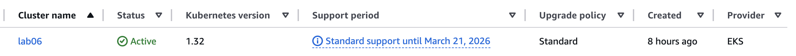

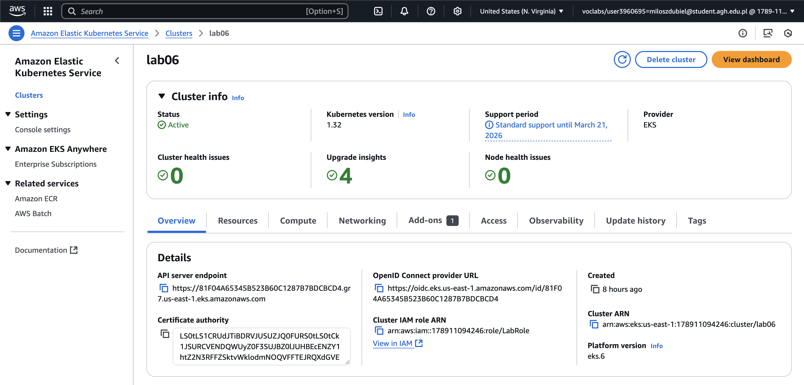

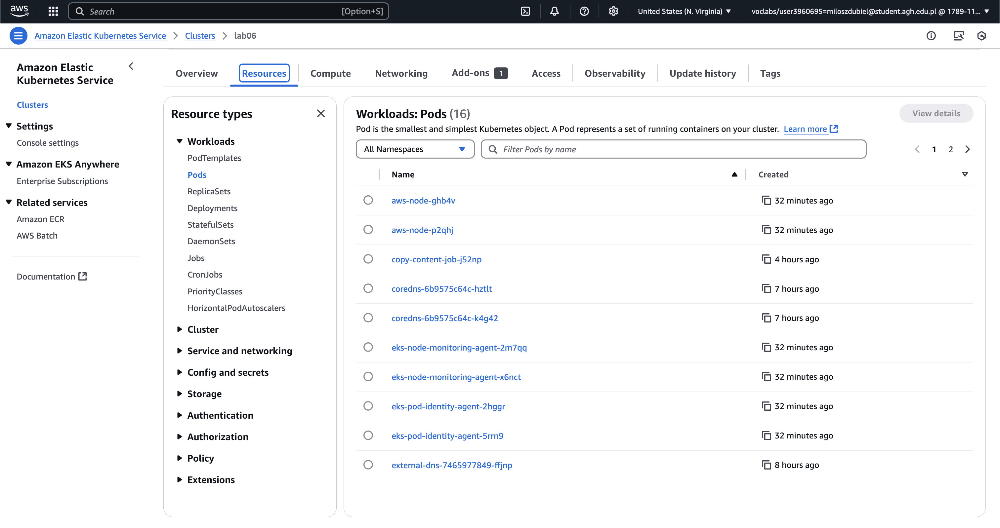

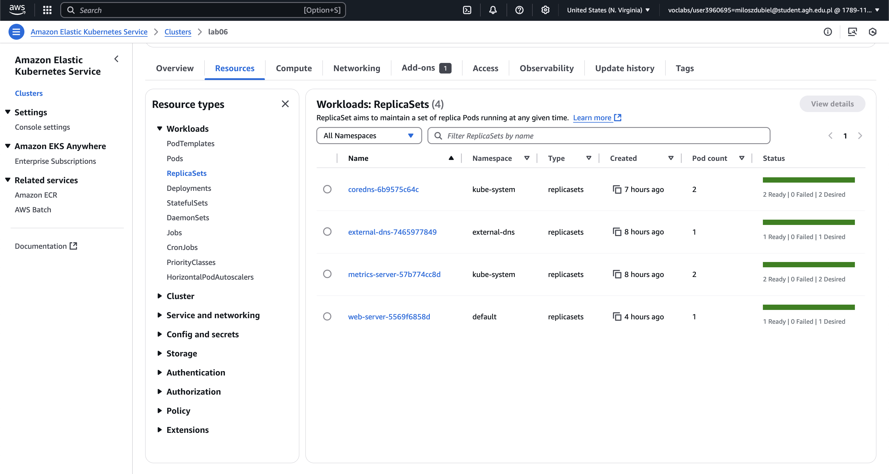

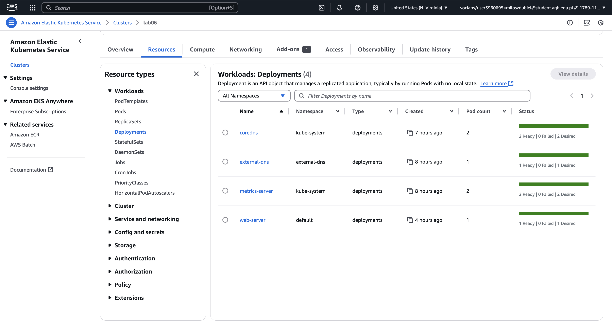

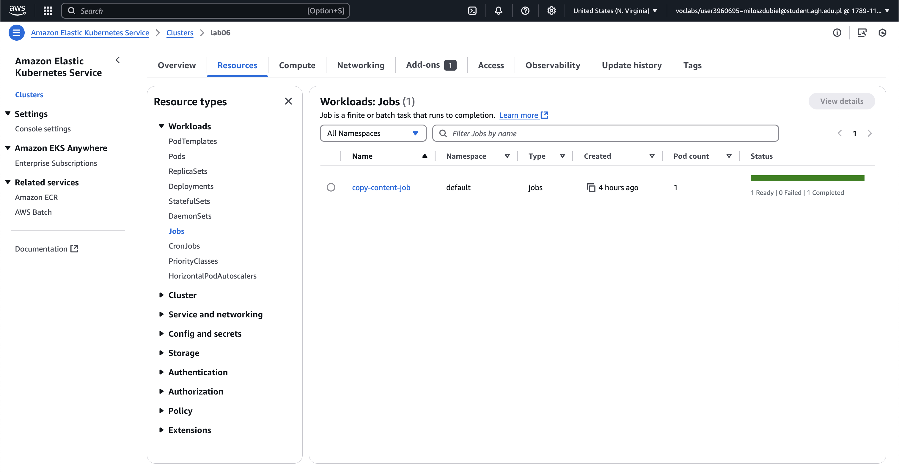

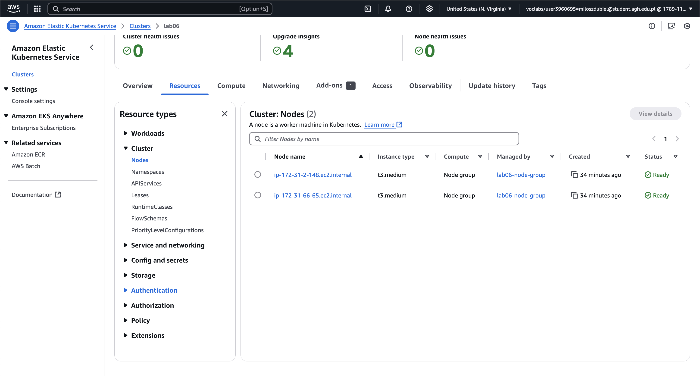

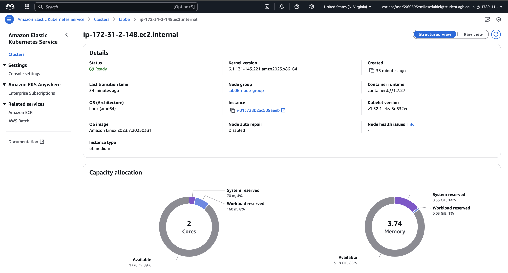

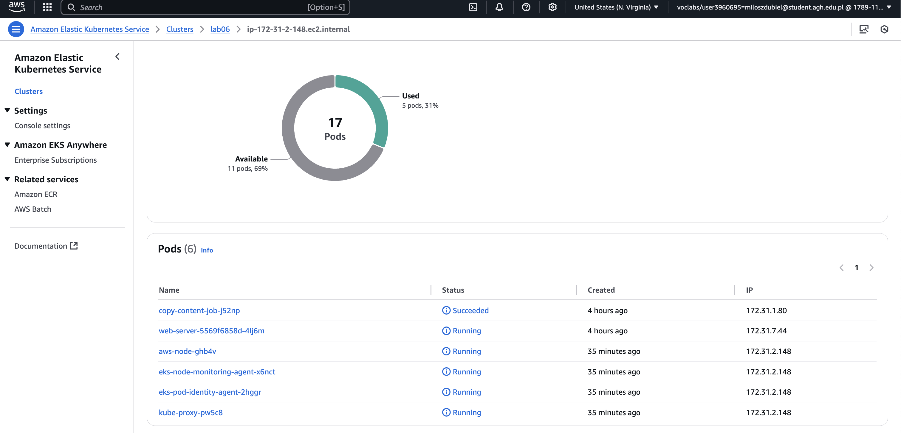

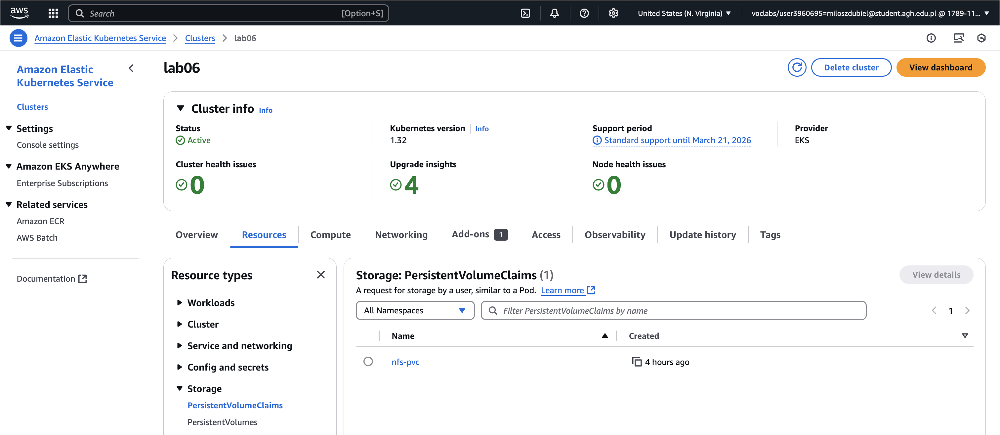

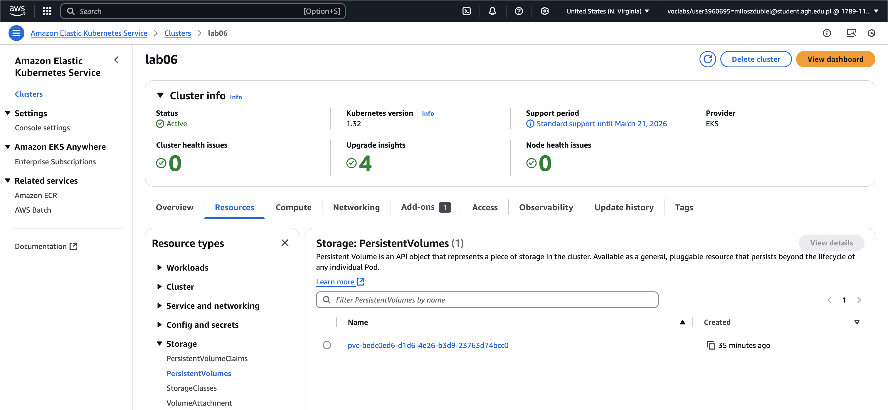

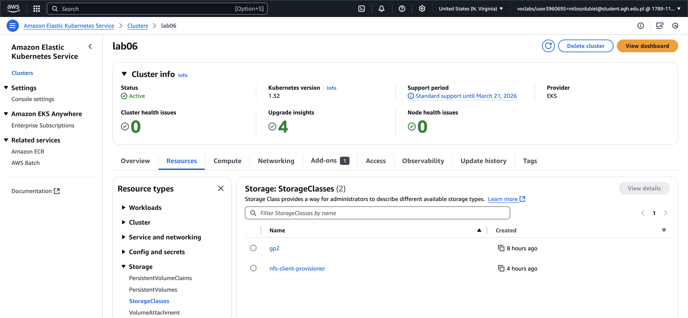

I decided to use EC2 machine to go through all the next steps.

I installed and set up AWS CLI using commands:

```sh
curl "https://awscli.amazonaws.com/awscli-exe-linux-x86_64.zip" -o "awscliv2.zip"
sudo apt install unzip
unzip awscliv2.zip
sudo ./aws/install
aws configure
```

I installed helm using commands:

```sh
curl -fsSL -o get_helm.sh https://raw.githubusercontent.com/helm/helm/main/scripts/get-helm-3
chmod 700 get_helm.sh
./get_helm.sh
```

I also installed eksctl using commands:

```sh
ARCH=amd64
PLATFORM=$(uname -s)_$ARCH
curl -sLO "https://github.com/eksctl-io/eksctl/releases/latest/download/eksctl_$PLATFORM.tar.gz"
tar -xzf eksctl_$PLATFORM.tar.gz -C /tmp && rm eksctl_$PLATFORM.tar.gz
sudo mv /tmp/eksctl /usr/local/bin
```

And kubectl:

```sh
curl -LO "https://dl.k8s.io/release/$(curl -s https://dl.k8s.io/release/stable.txt)/bin/linux/amd64/kubectl"
chmod +x kubectl
sudo mv kubectl /usr/local/bin/
```

After all the necessary installations, I configured kubectl to use the AWS EKS instance I set up earlier:

```sh
aws eks --region us-east-1 update-kubeconfig --name lab06
```

This made the `.kube/config` file to look like this:

```yaml
apiVersion: v1
clusters:
- cluster:
    certificate-authority-data: LS0tLS1CRUdJTiBDRVJUSUZJQ0FURS0tLS0tCk1JSURCVENDQWUyZ0F3SUJBZ0lJUHBEcENZY1htZ2N3RFFZSktvWklodmNOQVFFTEJRQXdGVEVUTUJFR0ExVUUKQXhNS2EzVmlaWEp1WlhSbGN6QWVGdzB5TlRBME1UY3dOVEUwTURWYUZ3MHpOVEEwTVRVd05URTVNRFZhTUJVeApFekFSQmdOVkJBTVRDbXQxWW1WeWJtVjBaWE13Z2dFaU1BMEdDU3FHU0liM0RRRUJBUVVBQTRJQkR3QXdnZ0VLCkFvSUJBUURoeDZUeHg4M2cvckQxd3RNUFcwdVdEV09KT3NkcEVqOEM4OFZhR3ZUeDB6YnpKWklHeWptcllMZjcKY0M5Yko3d1NRbnhrZjFZOS9RVm80UDJScENocXNadjNsbTJUTU5WUnRGdkZvb0p5ZllaUHRDcGlhVjV5QkVyeAp4QUFGaFN3NGxSZFJOT2x5K3VBSWlXcDEwUjhYTW1Da2VuOGNNYi9rSVN1TXFzb1hSamRDc2lyYnZHcldoL29nClZlRzFaLzkwNjZ0d2NYclZCMHBGZ2FSOUpaWXRCU291QnhNTTVmL25KOFFkUGNkdHFGSXlTQUdLYlRWQUFKN2EKQUUxZ2g3ZEhaVnFVRTYwbG5TMThuUHpWTVFrbXFpYzVMRE12MXk2QTUvVDZsVGdoeitlZXU2NkdRR3B2UlhHaAovZUQ3ZlNXcklHRVV6UStuVloyVmlmYVNSS2lwQWdNQkFBR2pXVEJYTUE0R0ExVWREd0VCL3dRRUF3SUNwREFQCkJnTlZIUk1CQWY4RUJUQURBUUgvTUIwR0ExVWREZ1FXQkJUL1VScTF6Z29VQUFqTk45MWl1N1FXZGx4Sm5qQVYKQmdOVkhSRUVEakFNZ2dwcmRXSmxjbTVsZEdWek1BMEdDU3FHU0liM0RRRUJDd1VBQTRJQkFRQUR3UHBUK21GeApiUTI1MkltUXNGNGZRc1VheEZHaFdVOUZwMSs3U1d3Q2x5Vnl1YTVwaGp1dmN4M2x3NzN2V1pnVG1iU04rWG1wCkJhbG0wMlo1eTJLZStHTnRKQ0d1cXFYRWh2N1RBQUwycFAyaERvRXRJejBraVZ4ckpyaXJBbDYzRUhVc01ydXQKcE85N2gvSVZEQkZKZ0tyOG9BNThxSVhlcU5VUGQ2Y0ZvVld2UlNTSldKYlhCbFBzZ0JaRFhLYXV2WHU2K0lLRApjK2pObXRaT1Yxak5VY3d0enBwcW80bnp4OStpdFRaOU5FWlBEUVYrbWFtK1krbXF0OEdiTXdLS2p1UnRjS2NkCmRJSnVNZnpSemNhWnpYdWtIQStFRCtYbDNmM2lkSitvQkw3YmxFS0U2Ynd6L3BGN3FXVTJCbjE3MTZ5RkxCMTIKL3pDQ0JJYk8vVHlWCi0tLS0tRU5EIENFUlRJRklDQVRFLS0tLS0K
    server: https://81F04A65345B523B60C1287B7BDCBCD4.gr7.us-east-1.eks.amazonaws.com
  name: arn:aws:eks:us-east-1:178911094246:cluster/lab06
contexts:
- context:
    cluster: arn:aws:eks:us-east-1:178911094246:cluster/lab06
    user: arn:aws:eks:us-east-1:178911094246:cluster/lab06
  name: arn:aws:eks:us-east-1:178911094246:cluster/lab06
current-context: arn:aws:eks:us-east-1:178911094246:cluster/lab06
kind: Config
preferences: {}
users:
- name: arn:aws:eks:us-east-1:178911094246:cluster/lab06
  user:
    exec:
      apiVersion: client.authentication.k8s.io/v1beta1
      args:
      - --region
      - us-east-1
      - eks
      - get-token
      - --cluster-name
      - lab06
      - --output
      - json
      command: aws
```

Then, I installed NFS server and provisioner in the cluster:

```sh
helm repo add stable https://charts.helm.sh/stable
helm repo update
helm install nfs-server stable/nfs-server-provisioner --set storageClass.name=nfs-client-provisioner
```

After that, I prepared `pvc.yaml` file:

```yaml
apiVersion: v1
kind: PersistentVolumeClaim
metadata:
  name: nfs-pvc
spec:
  accessModes:
    - ReadWriteMany
  resources:
    requests:
      storage: 512Mi
  storageClassName: nfs-client-provisioner
```

And I applied it using command:

```sh
kubectl apply -f pvc.yaml
```

The same goes for `deployment.yaml`:

```yaml
apiVersion: apps/v1
kind: Deployment
metadata:
  name: web-server
spec:
  replicas: 1
  selector:
    matchLabels:
      app: web-server
  template:
    metadata:
      labels:
        app: web-server
    spec:
      containers:
        - name: nginx
          image: nginx:latest
          volumeMounts:
            - mountPath: /usr/share/nginx/html
              name: nfs-volume
      volumes:
        - name: nfs-volume
          persistentVolumeClaim:
            claimName: nfs-pvc
```

```sh
kubectl apply -f deployment.yaml
```

And `service.yaml`:

```yaml
apiVersion: v1
kind: Service
metadata:
  name: web-server-service
spec:
  selector:
    app: web-server
  ports:
    - protocol: TCP
      port: 80
      targetPort: 80
  type: LoadBalancer
```

```sh
kubectl apply -f service.yaml
```

And `job.yaml`:

```yaml
apiVersion: batch/v1
kind: Job
metadata:
  name: copy-content-job
spec:
  template:
    spec:
      containers:
        - name: busybox
          image: busybox
          command: ["sh", "-c", "echo '<h1>Hello, Kubernetes!</h1>' > /mnt/nfs/index.html"]
          volumeMounts:
            - mountPath: /mnt/nfs
              name: nfs-volume
      volumes:
        - name: nfs-volume
          persistentVolumeClaim:
            claimName: nfs-pvc
      restartPolicy: Never
```

```sh
kubectl apply -f job.yaml
```

After setting up everything and going to the website hosting my cluster, I was able to see the content:

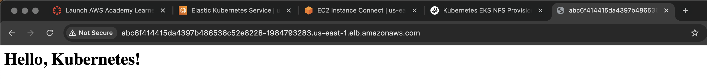